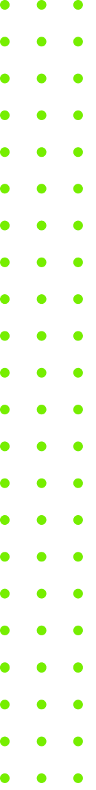
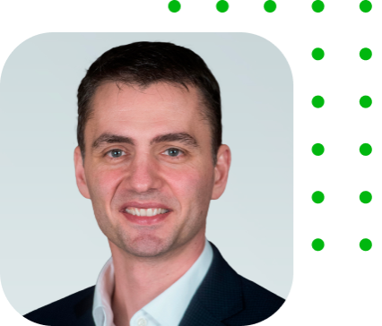

<!DOCTYPE html>
<html lang="en" dir="ltr">

  <head>
    <!-- This includes all languages WW -->
    <meta charset="utf-8">
    <!-- The Viewport is used so that everything is capatible for all devices -->
    <meta name="viewport" content="width=device-width, initial-scale=1">
    <meta name="description" content="Veeam Coding Challenge">
    <meta name="author" content="Malcolm Strong">
    <title>Veeam Coding Challenge</title>
    <link rel="stylesheet" href="./Assets/CSS/style.css">
    <link rel="preconnect" href="https://fonts.googleapis.com">
    <link rel="preconnect" href="https://fonts.gstatic.com" crossorigin>
    <link rel="stylesheet" href="https://cdnjs.cloudflare.com/ajax/libs/font-awesome/5.15.3/css/all.min.css" integrity="sha512-iBBXm8fW90+nuLcSKlbmrPcLa0OT92xO1BIsZ+ywDWZCvqsWgccV3gFoRBv0z+8dLJgyAHIhR35VZc2oM/gI1w==" crossorigin="anonymous"
      referrerpolicy="no-referrer" />
  </head>

  <body>
    <!-- Hero-Logo Section -->
    <section class="Hero">
      
      

        

          
          <h3>Flag</h3>
          <h1>Veeam Velocity</h1>
          <h1>Renewals</h1>
          <h3>Sunday, Aug 1</h3>
          
        

        <!-- Register Form -->
        

          <h2>Register to attend</h2>
          <form>
            

              <input type="text" name="name" placeholder="First Name*" required>
            

            

              <input type="text" name="name" placeholder="Last Name*" required>
            

            

              <input type="email" name="name" placeholder="Business Email*" required>
            

            <input type="checkbox" name="name" placeholder="Checkbox" required>
            <label for="newsletter">Yes, I want to receive communications about Veeam products, services and events. I can unsubscribe at any time.</label>
            
By registering you agree to the <a href="https://www.veeam.com/privacy-policy.html" target="_blank">Veeam Privacy Policy</a>.

            <input type="submit" name="" value="Register Now" class="form-btn btn">
          </form>
          
        

      

    </section>
    <!-- Information Section -->
    <section class="Information">
      

        <h2 class="info-heading">Our ProPartner Program is designed to help you</h2>
        

          

            
          

          

            
Are you challenged by meeting the demands of the Always‑On Enterprise™ and maximizing your organization's investment in the Modern Data Center? If so, join us for a webinar where you'll learn how Veeam® Software and Nutanix’s joint
              solution can help you achieve:

            <ul>
              <li>Improve Productivity</li>
              <li>Create powerful solutions for fast backup and fast restore </li>
              <li>Improve efficiency across your business</li>
              <li>And More</li>
            </ul> 
            
Learn how organizations like yours can benefit from Cisco and Veeam®.
 
            <h4>Gain access to innovative learning tools</h4>
          

          

            <button type="button" name="button" id="modalBtn" class="info-btn btn">Watch Now</button>
          

        

        

      

    </section>
    <!-- Modal Box -->
    

      

        

          &times;
          
        

        <iframe width="720" height="505" src="https://www.youtube.com/embed/yxhTq9s-pbw" title="YouTube video player" frameborder="0" allow="accelerometer; autoplay; clipboard-write; encrypted-media; gyroscope; picture-in-picture"
          allowfullscreen></iframe>
      

    

    <!-- Team Section -->
    <section class="Team">
      

        <h2 class="team-heading">Learn from our experts</h2>

        

          

            
            <h4>Danny Allen</h4>
            <h5>Chief Technology Officer</h5>
          

          

            
            <h4>Olivier Robinne</h4>
            <h5>Vice President, EMEA</h5>
          

          

            
            <h4>Mike Resseler</h4>
            <h5>Director Product Management</h5>
          

          

            
            <h4>Rick Vanover</h4>
            <h5>Senior Director, Product Strategy</h5>
          

          

            
            <h4>Michael Cade</h4>
            <h5>Senior Global Technologist, Product Strategy </h5>
          

        

      

    </section>
    <!-- Footer -->
    <footer class="footer">
      

        

          

            
&copy; 2021 Veeam® Software | Privacy Policy & Cookies | EULA | Licensing Policy

            

              <a href="https://twitter.com/Veeam?ref_src=twsrc%5Egoogle%7Ctwcamp%5Eserp%7Ctwgr%5Eauthor" target="_blank"><i class="fab fa-twitter"></i></a>
              <a href="https://www.facebook.com/VeeamSoftware/" target="_blank"><i class="fab fa-facebook"></i></a>
              <a href="https://github.com/topics/veeam-backup" target="_blank"><i class="fab fa-github"></i></a>
              <a href="https://www.youtube.com/channel/UC5YkxcYCG5b-fCcvHniW_ag" target="_blank"><i class="fab fa-youtube"></i></a>
            

          

        

      

    </footer>

    
  </body>

</html>

/* Universal Attributes */
* {
  box-sizing: border-box;
  /* Box-Sizing allows us to include the padding and border in an element's total width and height. */
  margin: 0;
  /* This resets the margin for all elements globally due to default margin on elements due to the browser  */
  padding: 0;
  /* This resets the padding for all elements globally due to default padding on elements due to the browser  */
}

body {
  font-family: 'Tahoma';
  color: #333;
  line-height: 1.6;
  /* The line height is here set to 1.6. This is a unitless value;
meaning that the line height will be relative to the font size. This is usually recommended */
  background-color: #ffffff;
}

a {
  text-decoration: none;
  /* This gets rid of all underlines on links */
  color: #333;
}

h1, h2, h3 {
  font-weight: 400;
  /* This will make Headers 1-3 a little lighter in boldness than normal */
  line-height: 1.2;
  /* This will make the space between paragrphs a tad bit shorter/smaller */
  margin: 10px 0;
  /* Margin on ONLY top and bottom. This will add some space between headers. */
}

p {
  margin: 10px 0;
  /* Margin on ONLY top and bottom. This will add some space between paragraphs. */
}

img {
  width: 100%;
  /* This will keep the width of the images inside the set container. So even with a larger image, it will stay within the set container */
}

/* Universal Colors */
:root {
  --maingreen-color: #004550;
}

/* Hero Section */
.Hero {
  background-color: var(--maingreen-color);
  color: #fff;
  position: relative;
  box-shadow: 0px 4px 4px rgba(0, 0, 0, 0.25);
}

.Hero h1 {
  font-size: 70px;
}

.Hero .Veeam-Dots {
  width: 5%;
  position: absolute;
  top: 450px;
}

.Hero-Heading h1,h3 {
  padding-left: 70px;
}

.Hero-Heading .Veeam-Logo {
  width: 50%;
  padding-left: 70px;
  padding-top: 70px;
}

.Hero-Heading h3 {
  padding-top: 50px;
  font-size: 30px;
}

.Hero-Heading .Veeam-Computer {
  float: right;
  width: 40%;
  margin-top: -180px;
}

.Hero-Form {
  padding-bottom: 90px;
}

.Hero-Form .form-layout {
  margin: 25px 0;
}

.Hero-Form h2 {
  padding-bottom: 20px;
}

.Hero-Form input[type='text'],
.Hero-Form input[type='text'],
.Hero-Form input[type='email'] {
  width: 100%;
  padding: 15px;
  font-size: 15px;
}

.Hero-From input:hover {
  outline: none;
}

.Hero-Form a {
  text-decoration: none;
  color: #93ea20;
}

.Hero-Form .Veeam-Dots-Form {
  width: 3%;
  position: absolute;
  right: 0px;
  bottom: 90px;
}

/* Information Section */
.Information {
  padding-top: 100px;
}

.Information .info-heading {
  text-align: center;
  padding-bottom: 30px;
  font-weight: 400;
  font-size: 40px;
}

.Information h4 {
  font-weight: normal;
  font-size: 20px;
}

.info-text ul {
  margin-left: 15px;
}

.info-text li {
  padding: 0px 0px 10px;
}

.info-btn {
  font-family: Tahoma;
  font-size: 16px;
  padding: 10px 20px;
  cursor: pointer;
  background: #00b336;
  color: #fff;
  border-radius: 24px;
  text-transform: uppercase;
  font-weight: 600;
  border: none;
  margin: 330px 0px 0px 0px;
}

/* Team Section */
.Team {
  padding-top: 50px;
}

.Team .team-heading {
  font-weight: 400;
  font-size: 40px;
}

.pic {
  padding-top: 30px;
}

.Team .pic {
  text-align: center;
  margin: 18px 10px 40px;
  transition: transform 0.2s ease-in;
  flex: 1;
}

.Team h4 {
  font-size: 30px;
  font-weight: 400;
  padding: 10px 55px 0px 0px;
}

.Team h5 {
  font-size: 16px;
  font-weight: 400;
  padding: 5px 55px 0px 0px;
  color: #999999;
}

.Team .flex {
  flex-wrap: wrap;
}

.Team .pic:hover {
  transform: translateY(-15px);
}

/* Footer */
.footer {
  padding-top: 200px;
}

.grid-footer {
  grid-template-columns: 1fr 1fr;
  padding: 10px;
}

.footer-background {
  background: #F1F1F1;
}

.social {
  text-align: center;
}

.social a {
  padding: 10px;
}

/* Master Styles */
.container {
  max-width: 1500px;
  margin: 0 auto;
  overflow: auto;
  padding: 0 40px;
}

.flex {
  display: flex;
  flex-direction: row;
  justify-content: center;
  padding: 0 10px;
  margin: 0px auto;
  height: 100%;
}

.grid {
  display: grid;
  grid-template-columns: 2fr 1fr;
  grid-gap: 50px;
  justify-content: center;
  align-items: center;
  height: 100%;
}

.grid-info {
  grid-template-columns: 3fr 4fr 1fr;
}

hr {
  margin-top: 100px;
}

.center {
  text-align: center;
}

.Hero-Form .form-btn {
  font-family: Tahoma;
  font-size: 16px;
  display: inline-block;
  padding: 12px 24px;
  cursor: pointer;
  background: #93ea20;
  color: #005f4b;
  border-radius: 99px;
  width: 100%;
  text-transform: uppercase;
  font-weight: 600;
  margin-top: 35px;
  border: none;
}

.btn:hover {
  transform: scale(0.98);
}

/* Modal */
.modal {
  display: none;
  position: fixed;
  z-index: 1;
  left: 0;
  top: 0;
  height: 100%;
  width: 100%;
  overflow: auto;
  background-color: rgba(0, 0, 0, 0.9);
}

.modal-content {
  text-align: center;
  background-color: rgba(0, 0, 0, 0);
  border-radius: 10px;
  margin: 10% auto;
  padding: 60px;
  width: 40%;
  animation-name: modalOpen;
  animation-duration: 1s;
}

.modal-content iframe {
  border: 10px transparent;
}

.modal-header {
  padding: 15px;
}

.modal-header img {
  margin: 0;
  width: 40%;
}

#closeBtn {
  color: #ccc;
  float: right;
  font-size: 50px;
}

#closeBtn:hover, #closeBtn:focus {
  color: #00b336;
  text-decoration: none;
  cursor: pointer;
}

@keyframes modalOpen {
  from{opacity: 0}
  to {opacity: 1}
}

/* Media Query */

/* Tablets / Under */
@media (max-width: 768px) {
  .grid,
  .Hero .grid,
  .Information, .grid,
  .footer .grid {
    grid-template-columns: 1fr;
  }
  .Hero-Heading .Veeam-Computer,
  .Hero .Veeam-Dots,
  .Hero-Form .Veeam-Dots-Form,
   .modal-header {
    display: none;
  }
  .Team .team-heading {
    text-align: center;
  }
  .Hero-Heading h1,h3 {
    text-align: center;
  }
  .Hero-Heading .Veeam-Logo {
    width: 100%;
  }
  .info-btn {
    margin: auto;
    width: 100%;
  }

}

/* Mobile */

@media (max-width: 500px) {

}

// Get the Modal
var modal = document.getElementById('simpleModal');

// Get open Modal button
var modalBtn = document.getElementById('modalBtn');

// Get the closeBtn
var closeBtn = document.getElementById('closeBtn');

// Listen for a Click
modalBtn.addEventListener('click', openModal);

// Listen for close btn click
closeBtn.addEventListener('click', closeModal);

// Outside/Window Click to close
window.addEventListener('click', outside);

// Function to open simpleModal
function openModal(){
  modal.style.display = 'block';
}

// When user clicks the closeBtn
function closeModal(){
  modal.style.display = 'none';
}

// When User Cliks Outside the boc
function outside(e){
  if(e.target == modal){
    modal.style.display = 'none';
  }
}
